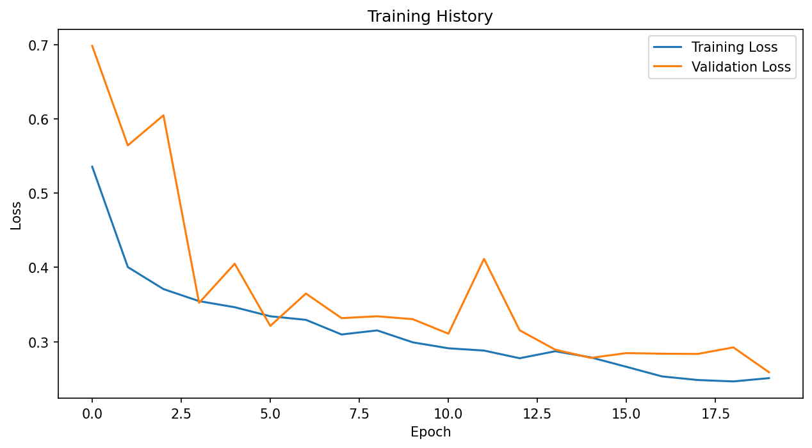
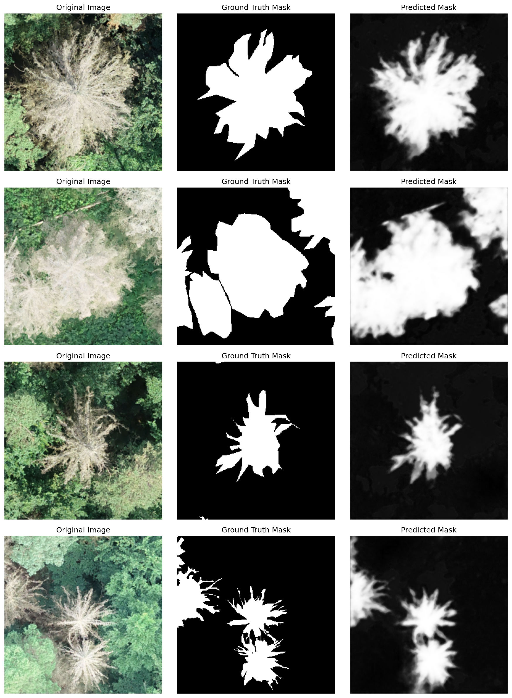

# Semantic Segmentation of Dead Trees


Reproduction of master thesis using pytorch

Install requirements.txt first
```shell
pip install -r requirements.txt
```

Modify this to match your folders and setup
```
    # =============================================================================
    # CONFIGURATION - Edit these variables to match your setup
    # =============================================================================
    IMAGE_DIR = "/Users/christian/Downloads/15168163/Training_data/Train"  # Directory containing training images (.png)
    MASK_DIR = "/Users/christian/Downloads/15168163/Training_data/Mask"  # Directory containing training masks (.png)
    EPOCHS = 20  # Number of training epochs
    BATCH_SIZE = 8  # Batch size for training
    LEARNING_RATE = 1e-4  # Learning rate
    IMG_SIZE = 256  # Input image size (will resize to IMG_SIZE x IMG_SIZE)
    VAL_SPLIT = 0.2  # Validation split ratio (0.2 = 20% for validation)
    N_CLASSES = 1  # Number of output classes (1 for binary segmentation)
    # =============================================================================
```


add the training_history.png

](training_history.png)

predictions._visualization
](predictions_visualization.png)


